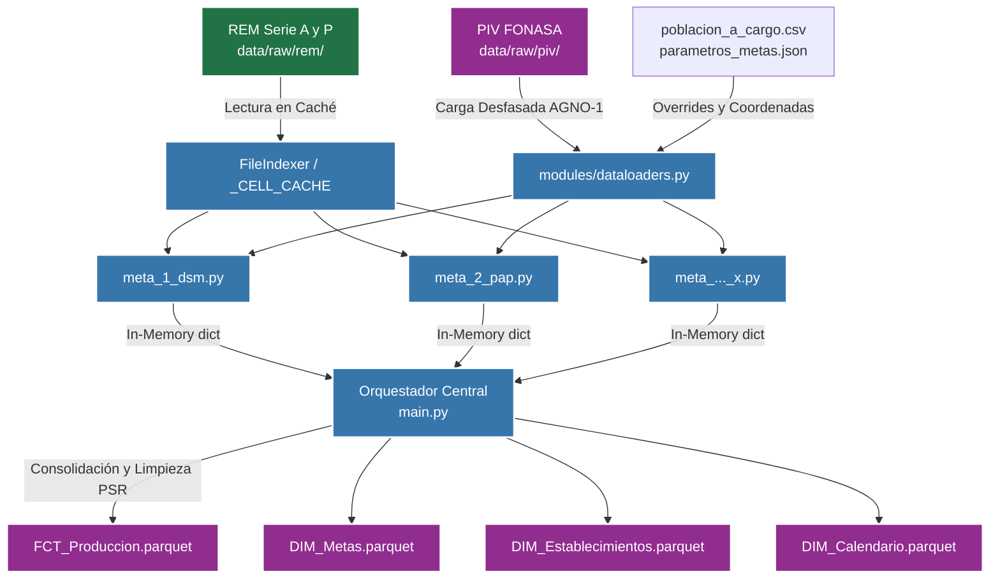

# Pipeline ELT Metas Sanitarias (Ley N° 19.813)
**Data Warehouse y Modelo Dimensional Estrella para Power BI**

[]()
[]()
[]()
[]()

**Desarrollado por:** Anghello Vega  
**Operado bajo:** DATA THOTH SpA  

---

## 📌 1. Visión General del Proyecto

Este repositorio contiene la arquitectura completa del Sistema de Extracción, Carga y Transformación (ELT) de datos clínicos y estadísticos en Atención Primaria de Salud (APS) en Chile. 

El propósito de este motor escrito en Python es consolidar de forma automatizada y auditable el **Cumplimiento de Metas Sanitarias (Ley N° 19.813)** de la red de Centros de Salud Familiar (CESFAM). Traduce de forma masiva planillas aisladas (REM y PIV) en un **Modelo de Datos Estrella consolidado en Apache Parquet**, optimizado para que Microsoft Power BI pueda leerlo de forma instantánea.

### 🌟 Módulos y Conceptos Clave Implementados:
- **Indexación Única en Memoria (`FileIndexer`)**: En lugar de leer el disco cientos de veces por script, el sistema mapea y escanea toda la red de archivos REM `xlsm` una única vez y usa una memoria caché, reduciendo el procesamiento de horas a minutos.
- **Modelado Dimensional Histórico**: Superando las limitaciones del aplanamiento anual, el sistema inyecta nativamente los campos transaccionales **Meta_Fijada** y **Meta_Nacional** por fila, aislando matemáticamente qué umbral de cumplimiento le regía a qué CESFAM en qué año específico.
- **Cero Producción Basura**: Toda la capa temporal (CSVs volátiles) ha sido purgada. Cada script consolida en diccionarios `list[dict]` pasados dinámicamente en RAM al ensamblador maestro de la *Fact Table*.

---

## 🏗️ 2. Arquitectura de Datos (Data Flow)

La tubería de datos asegura un flujo ininterrumpido a través del subdirectorio `REFACTORIZACION`, tolerando la ausencia intermitente de planillas de ciertos meses o periodos.



---

## ⚙️ 3. Lógicas del Negocio Inyectadas

Para que la métrica calce matemáticamente con el reglamento ministerial dictado anualmente:

1. **Desfase del Denominador (PIV)**: Según la norma, la Población Inscrita Validada usada para evaluar un año de producción, corresponde al corte de los inscritos vigentes a **Septiembre del año inmediatamente anterior**. (Ej: Para el análisis de producción de 2026, la Fact Table obligará a abrir el archivo `PIV_2025_09.parquet`).
2. **Excepciones Rurales / Override de Denominador**: Existen CESFAMs incipientes u hospitales de origen rural sin PIV propio. Si el motor detecta en el PIV `0 casos` asignados a un centro autorizado, hace un *fall-back* al archivo `data/dictionaries/poblacion_a_cargo.csv` donde toma la exigencia manual predefinida.
3. **Absorción de Postas de Salud Rural (PSR)**: La producción clínica de postas rurales (ej: PSR Conoco) es matemáticamente aglomerada e imputada a la línea transaccional de su Consultorio Base o CESFAM rector (ej: CESFAM M. Valech) establecido en el diccionario en `config.py`.
4. **Desconexión del Serie P**: Las metas preventivas, al ser prevalencias acumulables cerradas (Meta 4, Meta 5, Meta 7) extraen su producción desde la hoja `P3`, `P4`, etc. El pipeline restringe dinámicamente a qué corte mensual leer la sábana Serie P:
   - Evaluaciones Ene-May: El motor asume la fotografía del corte **Diciembre del año pasado**.
   - Evaluaciones Jun-Nov: El motor localiza la sábana del mes **Junio del año actual**.
   - Evaluación Diciembre: Se evalúa contra el **Diciembre corriente**.

---

## 🚀 4. Guía de Inicio y Despliegue

### Requisitos Técnicos
- **Sistema Operativo**: Windows Server / Pro (Testeado nativamente)
- **Lenguaje**: Python 3.10+
- **Librerías principales**: `pyarrow`, `pandas`, `openpyxl`

### 4.1 Preparación de Carpetas
Tu sistema en ambiente de producción debe sostener un depósito estrictamente mapeado para la ingesta de archivos.

```text
data/
  raw/
    piv/                          ← Depósito Base PIV Parquet
      2025/
        PIV_2025_09.parquet       ← Corte de la inscripción del Ministerio
    rem/
      2025/                       ← Colección Anual
        SERIE_A/
          01/                     ← Periodos numéricos
            121307A.xlsm
        SERIE_P/
          06/                     ← Cortes Semestrales
            121307P.xlsm
  dictionaries/
     parametros_metas.json        ← Configuración Maestra de Exigencias
     poblacion_a_cargo.csv        ← Fallback denominadores excepcionales
     COD_CENTROS_SALUD.CSV        ← Catálogo de nodos válidos
```

### 4.2 Control de Parámetros (`parametros_metas.json`)
Antes de correr procesos de evaluación de un nuevo año fiscal, ajusta este archivo maestro para dictarle al sistema qué umbrales, y desde qué coordenadas Excel (celdas) leerá los valores de cada Meta:
- Cambia anualmente las prevalencias estandarizadas en Chile (ej. `% DM2` poblacional).
- Edita las `metas` -> `fijada` de tu red. Cada nueva versión que subas será automáticamente inyectada estáticamente sobre toda la producción ELT que se ejecute a partir de ese momento. Esto evita mezclar bonos ganados frente a metas del pasado.

### 4.3 Ejecución del Pipeline

Abre tu consola, sitúate en la raíz del proyecto (carpeta `REFACTORIZACION`) y lanza el comando principal:

```powershell
python src/main.py
```

**Comportamiento en Operación:**
1. El motor purgará de forma segura (ignora errores de exclusión) cualquier modelo de Inteligencia de Negocios en caché y subdirectorios `data/processed/temp`.
2. Empezará a indexar masivamente los discos duros locales donde dejaste la serie A y P.
3. Detectará dinámicamente desde qué año tú cargaste información, lanzará los 7 hilos secuenciales (Meta 1 a Meta 7), loggeará cualquier *Dirty Data* y entregará **4 artefactos limpios en formato multidimensional Parquet**.

---

## 🛠️ 5. Salidas y Artefactos Integrables

El objetivo final del proceso es servir a conectores OLAP y reportes BI de grandes ligas. Tus modelos residirán en:
`data/processed/bi/`
- 📁 **`FCT_Produccion.parquet`**: El corazón del análisis. Registra mes a mes qué centro, en qué meta, tuvo cuánto numerador, con qué denominador y bajo qué Meta Fijada / Nacional exacta fue juzgado.
- 📁 **`DIM_Calendario.parquet`**: Dimensión de tiempo generada dinámicamente con atributos extra (bimestre, semestre, nombre mes).
- 📁 **`DIM_Establecimientos.parquet`**: Entidades geográficas mapeadas.
- 📁 **`DIM_Metas.parquet`**: Tipificación descriptiva de los indicadores Ley 19.813.

### Integración Microsoft Power BI
Para consumir este Modelo Estrella en **Power BI**, simplemente dirige el origen de datos a estas cuatro carpetas usando **"Carpeta de SharePoint"** o lectura **"Parquet Local"**. Las relaciones de modelo serán:
- `FCT_Produccion[Periodo_ID]` ↔️ `DIM_Calendario[Periodo_ID]` (1 a Muchos)
- `FCT_Produccion[Establecimiento_ID]` ↔️ `DIM_Establecimientos[Establecimiento_ID]` (1 a Muchos)
- `FCT_Produccion[Meta_ID]` ↔️ `DIM_Metas[Meta_ID]` (1 a Muchos)

---
*Desarrollado para proveer analítica descriptiva escalable con grado gubernamental.*
